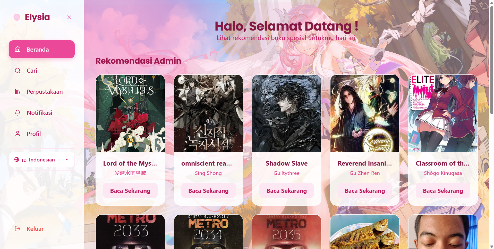
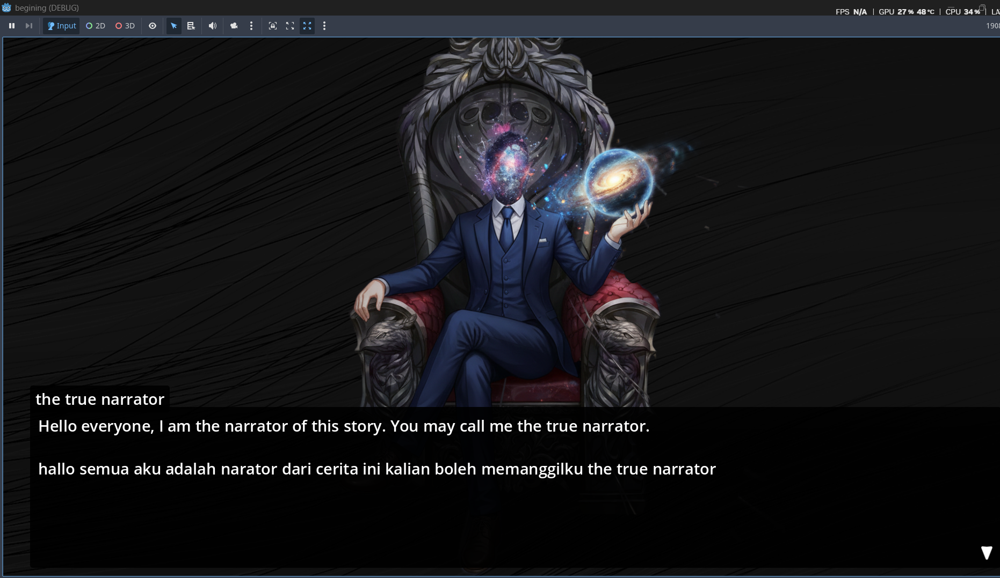

# 🌌 Muhammad Satriyo Wicaksono - Personal Portfolio

  

  
  
  

  <strong>Siswa Pengembangan Game di SMK Telkom Purwokerto | Game Dev Beginner</strong>

---

## 👨‍💻 Tentang Saya

Halo! Nama saya **Muhammad Satriyo Wicaksono** (biasa dipanggil Satriyo). Saya adalah seorang siswa di **SMK Telkom Purwokerto** jurusan **Pengembangan Game**.

Saya memiliki ketertarikan yang besar terhadap dunia game, pemrograman, dan teknologi secara umum. Ketertarikan ini bermula sejak kecil karena sering bermain game seperti *Honkai: Star Rail* dan *Honor of Kings*, yang akhirnya memicu rasa penasaran saya tentang bagaimana game tersebut dirancang dan dikembangkan. Saat ini, saya fokus mempelajari pembuatan game serta website dari dasar.

---

## 🚀 Hasil Project

Berikut adalah beberapa project yang telah saya kembangkan dan saya tampilkan dalam portofolio ini:

### 1. 📖 Elysia-realm (Web Novel Reader)
* **Deskripsi:** Sebuah website membaca novel interaktif yang terinspirasi dari karakter Elysia (*Herrscher of Human: Ego*) dari game *Honkai Impact 3rd*. Memiliki fitur otentikasi akun untuk tipe admin dan user.
* **Tech Stack:** Bun, Elysia.js, PostgreSQL, TypeScript, JWT.
* **Link:** [Elysia-realm Website](https://elysia-realm.vercel.app/) | [GitHub Repositori](https://github.com/satriyoo09/elysia.git)

### 2. ⏳ Mystery of Time (Visual Novel Game)
* **Deskripsi:** Game visual novel bertema misteri dan waktu. Ini merupakan game pertama yang saya buat dan kembangkan secara mandiri menggunakan Godot Engine.
* **Tech Stack:** Godot Engine (GDScript).
* **Link:** [GitHub Repositori](https://github.com/satriyoo09/mystery-of-time.git)

### 📸 Tampilan Preview Project:

<table align="center">
  <tr>
    <td align="center"><b>Elysia-realm</b></td>
    <td align="center"><b>Mystery of Time</b></td>
  </tr>
  <tr>
    <td></td>
    <td></td>
  </tr>
</table>

---

  Dibuat dengan 💖 oleh <b>Muhammad Satriyo Wicaksono</b>. © 2026.

